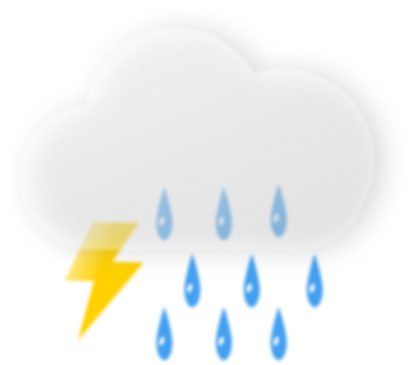

# Server-Side APIs: Weather Dashboard 

A weather dashboard application with search functionality to find current weather conditions and the future weather outlook for multiple cities.

## Application's functionality

* A weather dashboard with form inputs that will run in the browser and feature dynamically updated HTML and CSS.
  * When a user searches for a city they are presented with current and future conditions for that city and that city is added to the search history
  * When a user views the current weather conditions for that city they are presented with:
    * The city name
    * The date
    * An icon representation of weather conditions
    * The temperature
    * The humidity
    * The wind speed
  * When a user view future weather conditions for that city they are presented with a 5-day forecast that displays:
    * The date
    * An icon representation of weather conditions
    * The temperature
    * The humidity
  * When a user click on a city in the search history they are again presented with current and future conditions for that city

## Mock-Up

The following image shows the web application's appearance and functionality:

## Live version

http#

---

© 2023 | Sorada Wright | All Rights Reserved.
